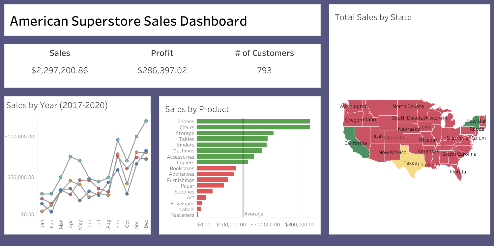

# American Superstore Sales Dashboard

## Overview
This project features an interactive Tableau dashboard built to visualize sales, profit, and shipping performance for a fictional American superstore. The dashboard includes dynamic filters, drill-down capabilities, and prescriptive analytics to identify trends and areas for improvement.

## Dashboard
View the interactive dashboard on Tableau Public:
[American Superstore Sales Dashboard](https://public.tableau.com/views/AmericanSuperstoreSales/American_Superstore_dashboard_1?:language=en-US&:sid=&:redirect=auth&:display_count=n&:origin=viz_share_link)

## Features
- **Dynamic Filters**: Filter by region, category, and time period.
- **Drill-Down Analysis**: Explore detailed sales and profit metrics.
- **Prescriptive Insights**: Identify root causes of performance trends.
- **Visualizations**: Bar charts, line graphs, pie chart, packed bubble and map for intuitive insights.

## Dataset
Tableau Superstore dataset: [Link](https://community.tableau.com/s/question/0D54T00000CWeX8SAL/sample-superstore-sales-excelxls?language=en_US)

## Tools Used
- Tableau Public
- Superstore dataset (publicly available from Tableau)

## How to View
1. Click the link above to access the dashboard on Tableau Public.
2. Interact with filters and tabs to explore the data.

## License
This project is licensed under the MIT License - see the [LICENSE](LICENSE) file for details.

## Author
- Theresa Gyamfi Allotey
